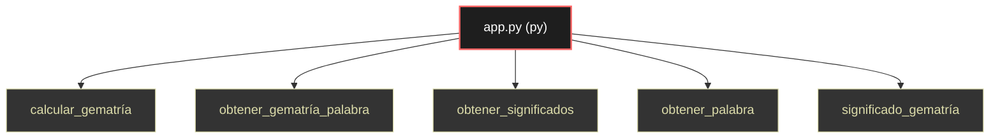

# Polyglot Codebase Knowledge Graph

> Generated offline by **readmenator**. Supports C, C++, Python, Go, Rust, JS/TS, Java, C#, Shell, PHP, Dart, GDScript, Nim, ASM.
> No LLMs. No tokens. Pure static analysis.

**Total Files Parsed:** 1 | **Total Symbols Extracted:** 5 | **Total Imports:** 0

## Structural Knowledge Map

---

## Architecture Reference

### PY (1 files)

#### `app.py`
**Path:** `app.py`

**Functions:**
- `calcular_gematría` (line 1)
- `obtener_gematría_palabra` (line 14)
- `obtener_significados` (line 19)
- `obtener_palabra` (line 58)
- `significado_gematría` (line 97)
